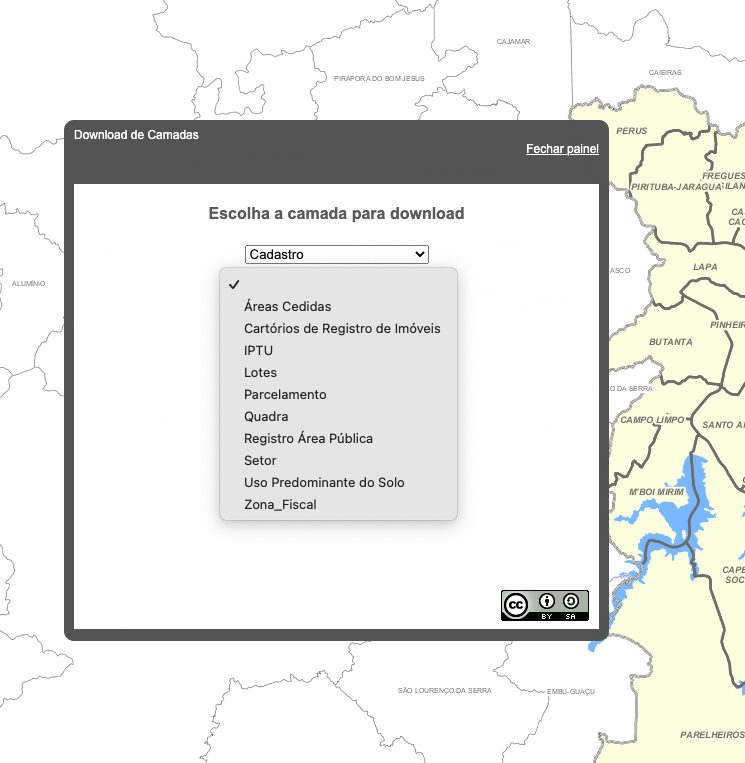
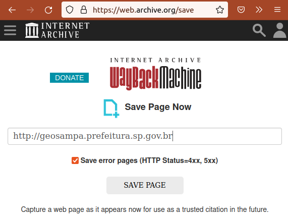

# Registro proveniência do domínio da doação

> ✋ ESCOPO: procedimentos para registro de evidẽncia da *proveniência* dos dados, comprovando-se a **enquivalência entre doador e  proprietário do endereço Internet que comparece na doação *online***.

Os arquivos preservados pela Digital-Guard podem ser provenientes de diferentes origens, tipicamente *download* de páginas oficiais do doador, e anexos de e-mail enviados por preposto oficial do doador.

Em ambos os casos a evidência primária de comprovação é o [**nome de domínio**](https://en.wikipedia.org/wiki/Domain_name): deve-se comprovar que o domínio vinculado à origem dos dados doados era propriedade do doador no instante da doação, garantindo que o **CNPJ do proprietário** e o **CNPJ do suposto doador** são os mesmos naquela data.

## Registro da evidência de domínio

Tanto e-mails como páginas Web são de responsabilidade do proprietário do domínio que figura na "transação de doação" (ato de *download* ou de envio de e-mail). Exemplos de "URL da transação" e seu domínio:

Exemplo              | Hostname         | Nome de domínio
---------------------|------------------|-------------
`ibge@ibge.gov.br`   | `ibge.gov.br`    | `ibge.gov.br`
`http://geosampa.prefeitura.sp.gov.br` | `geosampa.prefeitura.sp.gov.br`    | `sp.gov.br`
`https://geoweb.vitoria.es.gov.br/#/shp` | `geoweb.vitoria.es.gov.br` | `es.gov.br`

No Brasil os proprietários de domínio podem ter seu CNPJ comprovado através da consulta ao **WHOIS do Registro-BR**,  https://registro.br/tecnologia/ferramentas/whois  Todavia nem sempre será o CNPJ do responsável final. Podem haver encadeamentos formais de responsabilidade. Tradicionalmente os governos estaduais e governos municipais não são designados na Internet diretamente por um domínio, mas por **subdomínios** (parte final do *hostname*). Nos exemplos a prefeitura de São Paulo é subdomínio de `sp.gov.br` e a prefeitura de Vitória é subdomínio de `es.gov.br`.

Os **subdomínios `gov.br`** dos estados são gerenciados por autarquias independentes, listadas em https://iprefeituras.com.br/como-ter-dominio-governamental    No exemplo `sp.gov.br` é gerenciado pela PRODESP, que oferece seu "WHOIS de subdomínio" em https://www.dominio.sp.gov.br

### Exemplo do e-mail IBGE

Suponhamos um simples arquivo CSV zipado, `listaAbreviacoesSP.csv.zip`, como pacote doado. A lista de abreviações de 3 letras dos municípios de São Paulo foi obtida por um antigo e-mail de agente do IBGE que anexava a lista em correspondência remetida por `fulano@ibge.org.br`, ou seja, domínio `ibge.gov.br`, que pode ser consultado diretamente no WHOIS do Registro-BR:  https://registro.br/tecnologia/ferramentas/whois/?search=ibge.gov.br

&nbsp;&nbsp;

A imagem da ilustrações acima, que destaca a porção da página onde o domínio é associado ao `CNPJ 33.787.094/0001-40`,  já configura parte das evidências.  

### Exemplo do *download* GeoSampa

Como vimos na tabela acima, a URL da página de *downloads* do GeoSampa é um pouco mais complexo, http://geosampa.prefeitura.sp.gov.br   Ela requer que primeiro seja estabelecido o vínculo do gestor PRODESP com o domínio `SP.GOV.BR`. PS: se buscar `geosampa.prefeitura.sp.gov.br` o resultado será o mesmo.

&nbsp;&nbsp;

Coletada essa evidência, que pode ser comum a diversos outros doadores, **estaremos comprovando o vínculo entre o domínio `sp.gov.br` e o `CNPJ 62.577.929/0001-35`** da PRODESP.   NOTA: o uso de serviços não-oficiais tais como Google ou [IPrefeituras/dominio-governamental](https://iprefeituras.com.br/como-ter-dominio-governamental) é meramente confirmativo e informal, não tem valor jurídico.

Em seguida consultamos a página (de responsabilidade da PRODESP) que faz  papel de "WHOIS de `sp.gov.br`", https://www.dominio.sp.gov.br   NOTA: se por azar não houvesse, seria necessária a consulta por e-mail ou eSIC, como no caso de `es.gov.br`.

&nbsp;&nbsp;

Evidencia-se por fim a relação entre o subdomínio `prefeitura.sp.gov.br` e o `CNPJ 46.392.080/0001-79` da Prefeitura, que é a o doador e responsável pelo GeoSampa.

### Exemplos de redirecionamento

Numa URL do tipo HTTP a *pasta* (também dita "diretório"), `http://dominio/pasta`, e o *subdomínio*, `http://subdomínio.domínio` são maneiras alternativas de se isolar um certo conteúdo e suas sub-páginas (tipicamente um sufixo `/subPasta`). Com frequência os administradores do *website* mudam esses endereços ao longo do tempo, inclusive intercambiando formas de representação, ora em pasta ora em subdomínio.

Para aproveitar nomes mais curtos ou populares, ou para evitar que antigas URLs se percam (ex. URL no interior das páginas de um CD-ROM ou de um arquivo PDF), os administradores de *websites* podem fazer uso da técnica conhecida como [*redirecionamento de URL*](https://en.wikipedia.org/wiki/URL_redirection), que consiste em renomear a página, direcionando o navegante para o novo nome. Exemplos:

* o domínio `OSM.org`, mais curto, é redirecionado para `OpenStreetMap.org`. Exemplo:  https://OSM.org/copyright ⇒ `https://www.openstreetmap.org/copyright`

* o subdomínio `prefeitura.sp.gov.br`, utilizado no passado, foi redirecionado em 2020 para `capital.sp.gov.br`. Exemplo:  https://prefeitura.sp.gov.br ⇒ `http://www.capital.sp.gov.br`

Esse tipo de situação é captada e certificada pelas "ferramentas de datação", discutidas a seguir. Comprovar será particularmente relevante quando a simples redução da URL não leva ao mesmo subdomínio. No  exemplo do subdomínio `geosampa.prefeitura.sp.gov.br` que não oferecia comprovação direta de `prefeitura.sp.gov.br` na data do *download*, devido ao redirecionamento.

## Datação da evidência

> ✋ ESCOPO: registro de "cópia e datação oficial" de uma página Web, feita por robôs de [*arquivamento da web*](https://en.wikipedia.org/wiki/Web_archiving).

Como os domínios podem mudar de proprietário ao longo dos anos, **é importante comprovar que outra testemunha tenha "visto" a mesma pǵanina no mesmo dia**. O interessante é que essas testemunhas estejam fazendo uso de outra rede de acesso à Internet, o que pode ser garantido quando o acesso se dá em outro país. E não importa se a "testemunha" é um ser humano ou um robô. O que importa é que o seu papel e seu relógio sejam formalmente reconhecidos &mdash; pelo Sistema Jurídico ou auditoria a que o *dataset* for submetido.

Atualmente dois robôs estrangeiros são reconhecidos:

* `web.archive.org`, também conhecido como [Wayback Machine](https://en.wikipedia.org/wiki/Wayback_Machine), e com algum histórico de utilização em tribunais. Apesar de pioneiro e amplamente reconhecido, tecnicamente vem apresentado instabilidades, o que não permite mais que seja o único robô de registro a se utilizar. Para gravar uma URL nova ou atualiza-la, usar  https://web.archive.org/save

* [`archive.ph`](https://archive.ph), mais moderno e funcional porém menos popular, também conhecido com [Archive Today](https://en.wikipedia.org/wiki/Archive.today). Permite o registro de págnas com conteúdo Javascript, tais como o WHOIS do Registro-BR e interfaces com mapas.

* Usando o *software* aberto [pywb](https://github.com/webrecorder/pywb) a Digital-Guard pode no futuro realizar sua própria cópia de segurança para garantir todas as formas de registro.

### Exemplos e procedimentos

No https://Archive.Today basta copiar e colar a URL na caixa da opção *"My url is alive and I want to archive its content"* e clicar no botão "SAVE":

O resultado do registro de `http://geosampa.prefeitura.sp.gov.br` em 15/04/2022 foi  https://archive.is/UBFqu

O mesmo foi feito com a página do Registro-BR com a consulta ao domínio `sp.gov.br`, que resultou em  https://archive.ph/eRrvE  com todos os conteúdos vizíveis e também gravados na forma de imagem *screenshot*.

No tradicional **Web Archive** deve-se utilizar https://web.archive.org/save as mesmas consultas foram realizadas, resultando em conteúdos parciais (javascript ausentes), portanto um registro menos efetivo:

* Consulta à página `www.dominio.sp.gov.br/dominiospgovbr/` em 2022-04-15 resultou em  http://web.archive.org/web/20220415184630/https://www.dominio.sp.gov.br/dominiospgovbr/

* Consulta à página `www.dominio.sp.gov.br/dominiospgovbr/` em 2022-04-15 resultou em  http://web.archive.org/web/20220415184630/https://www.dominio.sp.gov.br/dominiospgovbr/

* Consulta à página  `registro.br/tecnologia/ferramentas/whois/?search=sp.gov.br` em 2022-04-16 resultou em  http://web.archive.org/web/20220416151237/https://registro.br/tecnologia/ferramentas/whois/?search=sp.gov.br

* Consulta a `http://geosampa.prefeitura.sp.gov.br` em , http://web.archive.org/web/20220416151443/http://geosampa.prefeitura.sp.gov.br/PaginasPublicas/_SBC.aspx

* consulta a http://prefeitura.sp.gov.br  em http://web.archive.org/web/20220416151730/http://www.capital.sp.gov.br/

O Web Archive oferece problemas para os diversos casos, tanto de redirecionamento como de conteúdo dinâmico Javascript. Portanto a recomendação é usar o ArchiveToday.

## Evidências adicionais

Apresar de não ser imprescindível, pode-se agregar valor comprobatório através de evidências de que o site do domínio requerido pertence à entidade doadora.

Exemplo:  os *websites* do IBGE (https://ibge.gov.br) e da Prefeitura de São Paulo (https://prefeitura.sp.gov.br), apesar de não oferecerem página de auto-identificação (algo como "quem somos"), fazem uso consistente do nome oficial e sua logomarca.

<!--
Quando o doador oferece diretamente em suas páginas
http://geosampa.prefeitura.sp.gov.br

https://web.archive.org/web/*/http://geosampa.prefeitura.sp.gov.br

A comprovação do CNPJ de origem é feita pelo WHOIS,

https://registro.br/tecnologia/ferramentas/whois/?search=geosampa.prefeitura.sp.gov.br

que infelizmente não é uma página HTML, é só um acesso tipo ReactJS aos dados da API:

http://web.archive.org/web/20220415104902/https://registro.br/tecnologia/ferramentas/whois/?search=geosampa.prefeitura.sp.gov.br

por isso precisamos fazer um save-screen

-----

-->

## Como registrar no Preserv-BR

Conforme [Guia Geral do projeto Preserv](https://github.com/digital-guard/preserv/tree/main/docs/pt) (?)  As evidências de proveniência precisam ser registradas da seguinte forma:

1. Evidências exclusivas do doador, na pasta raiz `data/_donorEvidence` como complemento de [data/donor.csv](https://github.com/digital-guard/preserv-BR/blob/main/data/donor.csv).

      1.1. Relação entre CNPJ e domínios de propriedade do doador:   

      1.1. Relação entre CNPJ e domínios de propriedade do doador:   

2. Evidências do pacote doado, na pasta correspondente do pacote, no `make_conf.yaml`, por hora seguindo a regra da issue ...
.. licença  
